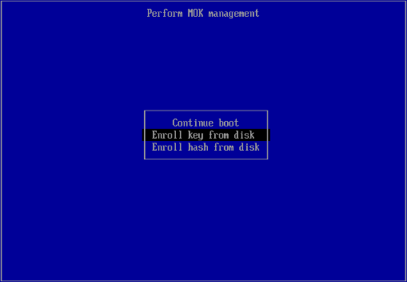

# MultiOS-USB

USB disk with multiple ISO files. Easy to use: install, copy ISO files and boot from USB.  
Supported update configuration files.  
[Display](config) a list of currently supported operating systems.

## Installation:

### Linux console

Check and install the required packages (in most cases they should be installed):
- curl or wget
- tar
- bzip2
- sgdisk
- wipefs
- mkfs.fat
- grub or grub2

[Download](https://github.com/Mexit/MultiOS-USB/archive/master.zip) or clone this repository, then run in the console:

```sh
$ sudo ./installer.sh [options] device [data_size]

 	device				Device to install (e.g. /dev/sdb)
 	data_size			Data partition size (e.g. 5G)
 	-fs, --fs_type			Filesystem type for the data partition [ext2|ext3|ext4|fat32|exfat|ntfs] (default: "FAT32")
 	-h,  --help			Display this message
 	-g,  --grub_inst_dir <NAME>	Specify a data subdirectory (default: "boot_MultiOS")
```
For example:
```sh
$ sudo ./installer.sh /dev/sdX
```
Replace `X` with your drive.

If you want to display list your all USB devices run installer without arguments:
```sh
$ ./installer.sh
```
### Image based installation (experimental)

Recommended installation method for Windows. Go to Releases and download the appropriate file.<br/><br/>

After installation, copy your ISO files to `/ISOs` directory and boot your computer from USB.  
You can also add your own configuration files to the `/boot_MultiOS/config_priv` directory. They will not be deleted during automatic MultiOS-USB update.

## First usage

First boot with enabled Secure Boot on each new computer requires to install a certificate.

  
Press OK

  
Select: Enroll key from disk

Search for `MultiOS-USB.cer` in EFI directory (`EFI/BOOT/cert/`) and confirm key enrolling.  
You can also immediately add certificates of popular distributions from [rEFInd](https://sourceforge.net/projects/refind/). They are located in `/boot_MultiOS/tools/refind-*/keys/`.

## Features:

- BIOS and UEFI support
- 64-bit (x86_64) UEFI (+ Secure Boot [from Fedora](https://apps.fedoraproject.org/packages/shim-x64)) support
- Load UEFI drivers
- Launch .efi executable files and other bootloaders
- Boot from .iso files
- Boot Windows 10 installer and Windows PE [more info](config/win10_winPE/windows_support.md)
- Boot Linux installer from network (experimental)

## Update MultiOS-USB:

You can add support for new operating systems. There is no need to reinstall!

##### Automatic update
All you need to do is download new configuration files by typing:
```sh
$ ./updater.sh
```

##### Manual update
- Download and unpack this repository
- Remove all files and directories on your USB in `/boot_MultiOS/config/`
- Copy downloaded files and directories from `config` to above directory. 

